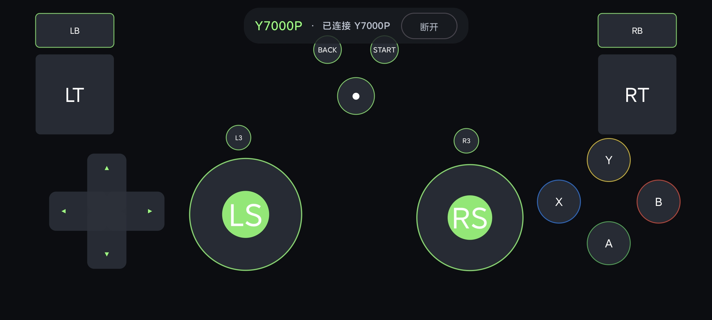

# MPad

**当前正式版：1.0.0**

[下载最新正式版](https://github.com/rayqwe1234/MPad/releases/latest)。APK 和 EXE 均作为独立文件提供，不会额外压缩。



MPad 可以把 Android 手机变成 Windows 游戏手柄。手机负责触控输入，Windows Companion 将操作转换为游戏可识别的 Xbox 360 / XInput 手柄信号。

## 主要功能

- **局域网伴侣模式（推荐）**：通过 UDP 低延迟传输手柄输入，通过 TCP 完成可靠配对、控制和震动回传。
- **蓝牙伴侣模式**：局域网不可用时，可以通过 RFCOMM 使用相同的安全配对协议。
- **蓝牙 HID 直连**：无需电脑伴侣，手机直接注册为通用蓝牙游戏手柄。
- **完整手柄布局**：包含双摇杆、十字键、LB/RB、LT/RT、BACK、START 和 ABXY。
- **自定义触控布局**：支持持续拖动、调整控件大小、摇杆跟手、死区、灵敏度、透明度和触觉反馈设置。
- **多点触控**：最多支持六点同时输入。
- **深色界面**：Android、Windows Companion 和测试器均适配深色显示。

Windows Companion 通过 ViGEmBus 创建一个虚拟 Xbox 360 手柄。蓝牙 HID 直连模式属于通用 DirectInput 设备，可能无法用于只接受 XInput 的游戏。

## 正式版下载

| 文件 | 用途 |
| --- | --- |
| [`MPad-1.0.0.apk`](https://github.com/rayqwe1234/MPad/releases/download/v1.0.0/MPad-1.0.0.apk) | Android 正式签名安装包 |
| [`MPad.Companion-1.0.0.exe`](https://github.com/rayqwe1234/MPad/releases/download/v1.0.0/MPad.Companion-1.0.0.exe) | Windows 电脑伴侣 |
| [`ViGEmBus_1.22.0_x64_x86_arm64.exe`](https://github.com/rayqwe1234/MPad/releases/download/v1.0.0/ViGEmBus_1.22.0_x64_x86_arm64.exe) | 虚拟 Xbox 360 手柄驱动 |
| [`MPad.Tester-1.0.0.exe`](https://github.com/rayqwe1234/MPad/releases/download/v1.0.0/MPad.Tester-1.0.0.exe) | 可选的 XInput 手柄测试器 |
| [`SHA256SUMS.txt`](https://github.com/rayqwe1234/MPad/releases/download/v1.0.0/SHA256SUMS.txt) | 发布文件 SHA-256 校验值 |

## 系统要求

### 手机端

- Android 9 或更高版本
- 局域网模式需要与电脑连接同一个网络
- 蓝牙 HID 直连功能是否可用取决于手机厂商是否开放 HID Device Profile

### 电脑端

- Windows 10 或 Windows 11（64 位）
- 使用伴侣模式时需要安装 ViGEmBus
- Windows 防火墙需要允许 MPad Companion 访问专用网络

## 首次使用：局域网伴侣

1. 安装 `ViGEmBus_1.22.0_x64_x86_arm64.exe`，并通过 Windows UAC 确认。该运行时驱动必须安装到 Windows Driver Store，无法改装到 D 盘。
2. 启动 `MPad.Companion-1.0.0.exe`。
3. Windows 防火墙询问权限时，只勾选**专用网络**。
4. 在手机上安装并打开 `MPad-1.0.0.apk`。
5. 确保手机与电脑位于同一个局域网。
6. 在手机端选择“局域网伴侣”，选择发现的电脑。
7. 输入电脑伴侣显示的六位首次配对码并连接。

首次配对成功后，认证令牌会分别受到 Android Keystore 和 Windows DPAPI 保护，之后连接同一台电脑通常不需要再次输入配对码。

如果自动发现被访客网络、AP 隔离或路由器设置阻止，可以在手机端手动输入电脑的 IPv4 地址。MPad 使用 UDP `26760` 和 TCP `26761`。

## 蓝牙模式

使用蓝牙功能前，请先在 Android 和 Windows 的系统蓝牙设置中完成配对。

- **蓝牙伴侣**：连接 Windows Companion 的 MPad RFCOMM 服务，仍然输出 XInput 手柄并支持游戏震动回传。
- **蓝牙 HID 直连**：将手机注册为通用 HID 手柄，不需要 Windows Companion；此模式只有手机触控震动，不支持游戏震动回传。

如果手机厂商禁用了 HID Device Profile，请改用局域网伴侣或蓝牙伴侣模式。

## 手柄测试器

启动 Windows Companion 并创建虚拟手柄后，可以运行 `MPad.Tester-1.0.0.exe` 检查游戏实际接收到的 XInput 数据。

- 检查所有按钮、双摇杆、十字键和模拟扳机数值。
- 如果其他实体或虚拟手柄占用了 1 号位置，可以切换到手柄槽位 2–4。
- 使用马达滑块或“双马达测试”检查游戏震动能否回传到手机。
- 关闭测试器、切换槽位或手柄断开时，两个马达都会自动停止。

开发环境中也可以运行 `scripts\run-tester.ps1`。

## 从源码构建

本项目要求所有开发工具、SDK 和缓存均放在 `D:\DevTools`。当前构建环境使用：

- Android SDK 36
- JDK 17
- Gradle 9.4.1
- Compose BOM 2026.04.01
- .NET 10
- Node.js 24（官网）

Android 项目暂时使用 Compose BOM 2026.04.01，因为当前稳定 Android SDK 仓库尚未提供 Compose 2026.08 所需的 `platforms;android-37`。

在 PowerShell 中运行：

```powershell
Set-Location D:\Codex\MPad
.\scripts\build.ps1
```

构建脚本会执行 Windows 协议测试、发布 Windows 自包含程序、运行 Android 单元测试并生成正式签名 APK。

输出文件：

- `dist\android\MPad-1.0.0.apk`
- `dist\windows\MPad.Companion-1.0.0.exe`
- `dist\windows\MPad.Tester-1.0.0.exe`
- `dist\windows\ViGEmBus_1.22.0_x64_x86_arm64.exe`
- `dist\windows\MPad-1.0.0\MPad.Companion.exe`
- `dist\windows\MPad-1.0.0\MPad.Tester.exe`
- `dist\SHA256SUMS.txt`

Android 正式签名保存在本机 `D:\DevTools\MPadSigning`，不会提交到 Git 仓库。后续更新必须继续使用同一签名。

## 安装 APK 到调试设备

连接已经授权 USB 调试的 Android 手机后运行：

```powershell
.\scripts\install-android.ps1
```

## 官网本地预览

官网源代码位于 `website`。目前只提供本地预览，尚未发布。

```powershell
Set-Location D:\Codex\MPad\website
D:\DevTools\Node\node-v24.20.0-win-x64\npm.cmd run dev
```

## 手动验证

```powershell
# Windows 协议测试与伴侣构建
$env:DOTNET_ROOT='D:\DevTools\DotNet'
$env:DOTNET_CLI_HOME='D:\DevTools\DotNetHome'
$env:NUGET_PACKAGES='D:\DevTools\NuGetCache'
D:\DevTools\DotNet\dotnet.exe test .\MPad.slnx
D:\DevTools\DotNet\dotnet.exe build .\windows\MPad.Companion\MPad.Companion.csproj

# Android 测试与正式 APK
$env:JAVA_HOME='D:\DevTools\Java\jdk-17.0.20.101-hotspot'
$env:ANDROID_HOME='D:\DevTools\Android\Sdk'
$env:GRADLE_USER_HOME='D:\DevTools\GradleCache'
Set-Location .\android
.\gradlew.bat testDebugUnitTest assembleRelease
```

实体蓝牙连接、HID、多点触控、游戏震动回传和端到端延迟必须在真实 Android 手机与支持蓝牙的 Windows 电脑上验证，模拟器无法完整验证这些行为。

## 项目结构

```text
android/    Android 手机端
windows/    Windows Companion、协议库与测试器
drivers/    ViGEmBus 许可证和校验信息
scripts/    构建、安装与运行脚本
website/    MPad 官网源码
docs/       通信协议说明
```
